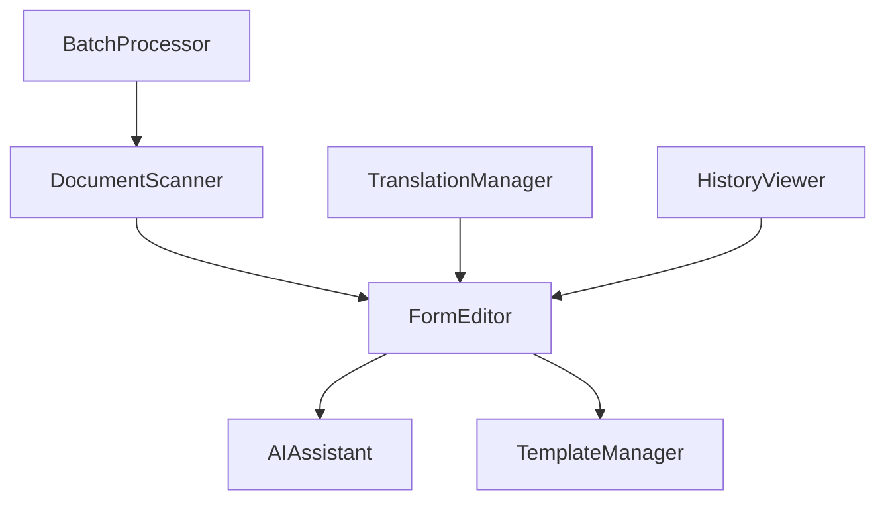

# Component Specifications

## Core Components

### 1. DocumentScanner
```typescript
interface DocumentScannerProps {
  onScan: (result: ScanResult) => void;
  onError: (error: Error) => void;
  language?: 'en' | 'ar';
  rtl?: boolean;
}

interface ScanResult {
  url: string;
  text: string;
  confidence: number;
  highlights: Array<{
    id: string;
    x: number;
    y: number;
    width: number;
    height: number;
    text: string;
  }>;
}
```

### 2. FormEditor
```typescript
interface FormEditorProps {
  initialFields: FormField[];
  onSave?: (fields: FormField[]) => Promise<void>;
  language?: 'en' | 'ar';
  rtl?: boolean;
}

interface FormField {
  id: string;
  type: 'text' | 'number' | 'date' | 'select';
  label: string;
  labelAr?: string;
  value: string;
  isValid?: boolean;
  error?: string;
  errorAr?: string;
  aiAssisted?: boolean;
  lastModified?: Date;
}
```

### 3. AIAssistant
```typescript
interface AIAssistantProps {
  onSuggestion?: (suggestion: string) => void;
  language?: 'en' | 'ar';
  rtl?: boolean;
}
```

### 4. TemplateManager
```typescript
interface TemplateManagerProps {
  templates: FormTemplate[];
  onSelect: (template: FormTemplate) => void;
  onEdit: (template: FormTemplate) => void;
  onDelete: (templateId: string) => void;
  categories: string[]; 
}

interface FormTemplate {
  id: string;
  name: string;
  fields: FormField[];
  category: string;
  metadata: TemplateMetadata;
}
```

## Shared Components

### 1. ProcessingIndicator
```typescript
interface ProcessingIndicatorProps {
  status: 'idle' | 'processing' | 'success' | 'error';
  progress?: number;
  message?: string;
  language?: 'en' | 'ar';
  rtl?: boolean;
}
```

### 2. ValidationFeedback
```typescript
interface ValidationFeedbackProps {
  errors?: ValidationError[];
  warnings?: ValidationWarning[];
  language?: 'en' | 'ar';
  rtl?: boolean;
}

interface ValidationError {
  field: string;
  message: string;
  messageAr?: string;
}
```

### 3. DocumentPreview
```typescript
interface DocumentPreviewProps {
  url: string;
  highlights?: Highlight[];
  onHighlightClick?: (highlight: Highlight) => void;
  language?: 'en' | 'ar';
  rtl?: boolean;
}

interface Highlight {
  id: string;
  x: number;
  y: number;
  width: number;
  height: number;
  color?: string;
}
```

## Feature Components

### 1. BatchProcessor
```typescript
interface BatchProcessorProps {
  files: File[];
  processConfig: ProcessingConfig;
  onProgress: (progress: BatchProgress) => void;
  onComplete: (results: ProcessingResult[]) => void;
  maxConcurrent?: number;
}
```

### 2. TranslationManager
```typescript
interface TranslationManagerProps {
  sourceLanguage: string;
  targetLanguages: string[];
  content: TranslatableContent;
  onTranslate: (translations: Translation[]) => void;
  preserveFormatting?: boolean;
}
```

### 3. HistoryViewer
```typescript
interface HistoryViewerProps {
  documentId: string;
  versions: DocumentVersion[];
  onRevert: (versionId: string) => void;
  onCompare: (version1: string, version2: string) => void;
  showDiff?: boolean;
}
```

## Advanced Features

### Form Templates
Template system for quick form creation and reuse.

```typescript
interface FormTemplate {
  id: string;
  name: string;
  nameAr?: string;
  description: string;
  descriptionAr?: string;
  fields: FormField[];
  category: string;
  metadata: {
    createdAt: Date;
    updatedAt: Date;
    author: string;
    version: string;
  };
  validationRules?: ValidationRule[];
  aiConfig?: AITemplateConfig;
}

interface TemplateManagerProps {
  templates: FormTemplate[];
  onSelect: (template: FormTemplate) => void;
  onSave: (template: FormTemplate) => void;
  onDelete: (templateId: string) => void;
  language?: 'en' | 'ar';
  rtl?: boolean;
}
```

### Keyboard Navigation
Enhanced keyboard control system.

```typescript
interface KeyboardShortcuts {
  navigation: {
    nextField: 'Tab';
    prevField: 'Shift+Tab';
    firstField: 'Home';
    lastField: 'End';
  };
  actions: {
    save: 'Ctrl+S';
    undo: 'Ctrl+Z';
    redo: 'Ctrl+Shift+Z';
    copy: 'Ctrl+C';
    paste: 'Ctrl+V';
    delete: 'Delete';
    selectAll: 'Ctrl+A';
  };
  aiAssistant: {
    toggle: 'Ctrl+Space';
    accept: 'Enter';
    reject: 'Esc';
  };
  view: {
    zoomIn: 'Ctrl++';
    zoomOut: 'Ctrl+-';
    resetZoom: 'Ctrl+0';
    togglePreview: 'Ctrl+P';
  };
}
```

### Field Validation Rules
Advanced validation system with custom rules.

```typescript
interface ValidationRule {
  id: string;
  type: 'required' | 'regex' | 'custom' | 'dependency' | 'format';
  params?: {
    pattern?: string;
    message?: string;
    messageAr?: string;
    dependsOn?: string[];
    validator?: (value: any, formData: any) => boolean;
  };
  severity: 'error' | 'warning' | 'info';
  condition?: (formData: any) => boolean;
}

interface ValidationContext {
  locale: string;
  timezone: string;
  formats: {
    date: string;
    number: string;
    currency: string;
  };
  customValidators: Record<string, (value: any) => boolean>;
}
```

### AI Learning System
Progressive AI learning from user corrections.

```typescript
interface AILearningSystem {
  feedback: {
    fieldId: string;
    originalValue: string;
    suggestedValue: string;
    acceptedValue: string;
    context: AIContext;
    timestamp: Date;
  };
  metrics: {
    accuracy: number;
    confidence: number;
    improvementRate: number;
  };
  training: {
    schedule: 'immediate' | 'batched' | 'scheduled';
    threshold: number;
    method: 'incremental' | 'full';
  };
}

interface AIModelMetrics {
  fieldAccuracy: Record<string, number>;
  overallAccuracy: number;
  confusionMatrix: {
    truePositives: number;
    falsePositives: number;
    trueNegatives: number;
    falseNegatives: number;
  };
  latency: {
    average: number;
    p95: number;
    p99: number;
  };
}
```

### Form Analytics
Usage and performance tracking system.

```typescript
interface FormAnalytics {
  usage: {
    totalForms: number;
    completionRate: number;
    averageTimePerField: number;
    errorRate: number;
    aiAssistanceRate: number;
  };
  performance: {
    loadTime: number;
    renderTime: number;
    aiResponseTime: number;
    validationTime: number;
  };
  user: {
    sessionDuration: number;
    interactions: number;
    corrections: number;
    preferredLanguage: string;
  };
}

interface AnalyticsConfig {
  enabled: boolean;
  trackingLevel: 'basic' | 'detailed' | 'full';
  anonymize: boolean;
  retention: number;
  endpoints: {
    collect: string;
    analyze: string;
  };
}
```

### Accessibility Features
Enhanced accessibility support.

```typescript
interface AccessibilityConfig {
  aria: {
    labels: Record<string, string>;
    descriptions: Record<string, string>;
    announcements: Record<string, string>;
  };
  keyboard: {
    focusOutline: boolean;
    tabIndex: number;
    shortcuts: KeyboardShortcuts;
  };
  visual: {
    highContrast: boolean;
    fontSize: number;
    animations: 'full' | 'reduced' | 'none';
  };
  screen: {
    readerMode: boolean;
    descriptions: boolean;
    announcements: boolean;
  };
}
```

### Internationalization
Advanced language and locale support.

```typescript
interface I18nConfig {
  languages: {
    code: string;
    name: string;
    direction: 'ltr' | 'rtl';
    dateFormat: string;
    numberFormat: string;
  }[];
  translations: Record<string, Record<string, string>>;
  fallback: string;
  formats: {
    date: Record<string, string>;
    number: Record<string, string>;
    currency: Record<string, string>;
  };
}

interface LocaleContext {
  language: string;
  direction: 'ltr' | 'rtl';
  formatters: {
    date: (value: Date) => string;
    number: (value: number) => string;
    currency: (value: number, currency: string) => string;
  };
}
```

## UI Structure

```
src/
├── components/
│   ├── core/
│   │   ├── DocumentScanner/
│   │   │   ├── index.tsx
│   │   │   ├── ScanPreview.tsx
│   │   │   └── ScanControls.tsx
│   │   ├── FormEditor/
│   │   │   ├── index.tsx
│   │   │   ├── FieldEditor.tsx
│   │   │   └── FormPreview.tsx
│   │   ├── AIAssistant/
│   │   │   ├── index.tsx
│   │   │   ├── Suggestions.tsx
│   │   │   └── ValidationView.tsx
│   │   └── TemplateManager/
│   │       ├── index.tsx
│   │       ├── TemplateList.tsx
│   │       └── TemplateEditor.tsx
│   ├── shared/
│   │   ├── ProcessingIndicator/
│   │   ├── ValidationFeedback/
│   │   ├── DocumentPreview/
│   │   └── ErrorBoundary/
│   └── features/
│       ├── BatchProcessor/
│       ├── TranslationManager/
│       └── HistoryViewer/
├── hooks/
│   ├── useDocumentScanner.ts
│   ├── useFormValidation.ts
│   ├── useAIAssistant.ts
│   └── useTemplates.ts
├── services/
│   ├── scanner.service.ts
│   ├── ai.service.ts
│   ├── template.service.ts
│   └── translation.service.ts
└── utils/
    ├── validation.ts
    ├── formatting.ts
    ├── ai-helpers.ts
    └── document-processing.ts
```

## Implementation Strategy

### Phase 1: Core Components
1. Set up base component structure
2. Implement basic functionality
3. Add TypeScript interfaces
4. Create unit tests

### Phase 2: Feature Integration
1. Connect with services
2. Implement state management
3. Add error handling
4. Create integration tests

### Phase 3: UI Polish
1. Add animations
2. Implement responsive design
3. Add accessibility features
4. Optimize performance

## Component Dependencies



## Next Steps

1. **Create Base Components**
   - Set up component folders
   - Add TypeScript interfaces
   - Create basic implementations

2. **Add Shared Components**
   - Implement ProcessingIndicator
   - Create ValidationFeedback
   - Add DocumentPreview

3. **Implement Features**
   - Connect with services
   - Add state management
   - Implement error handling

## Custom Hooks

### useFormHistory
Form state management with undo/redo and autosave.

```typescript
interface UseFormHistoryOptions {
  maxHistorySize?: number;
  autosaveInterval?: number;
  onAutosave?: (fields: FormField[]) => Promise<void>;
}

interface UseFormHistoryReturn {
  fields: FormField[];
  updateFields: (fields: FormField[] | ((prev: FormField[]) => FormField[])) => void;
  undo: () => void;
  redo: () => void;
  canUndo: boolean;
  canRedo: boolean;
  isSaving: boolean;
  startBatch: () => void;
  endBatch: (fields: FormField[]) => void;
  lastSaved: Date;
}
```

### useAIAssistant
AI service integration with retry and error handling.

```typescript
interface UseAIAssistantReturn {
  processing: boolean;
  getAISuggestions: (fields: FormField[]) => Promise<AISuggestion[]>;
}

interface AISuggestion {
  id: string;
  value: string;
  confidence: number;
}
```

## Services

### AIService
Resilient AI service with retry mechanism.

```typescript
interface RetryConfig {
  maxRetries: number;
  initialDelay: number;
  maxDelay: number;
  backoffFactor: number;
}

interface AIService {
  processDocument(document: File, options: AIRequest): Promise<AIResponse>;
  getSuggestions(fields: Array<{ id: string; value: string }>, context?: any): Promise<AISuggestion[]>;
  validateFields(fields: Array<{ id: string; value: string }>, rules?: any): Promise<ValidationResult[]>;
}
```

## Implementation Status

### Completed Features
- ✅ Document scanning and OCR
- ✅ Form field editing
- ✅ AI suggestions
- ✅ Undo/redo functionality
- ✅ Autosave
- ✅ Batch operations
- ✅ RTL support
- ✅ Multilingual UI
- ✅ Error handling
- ✅ Validation system
- ✅ Document preview
- ✅ Processing indicators

### In Progress
- 🔄 Clipboard operations
- 🔄 Advanced keyboard shortcuts
- 🔄 Field templates
- 🔄 Performance optimization
- 🔄 Form analytics integration
- 🔄 Enhanced accessibility features
- 🔄 Advanced validation rules
- 🔄 AI learning system

### Planned Features
- 📅 Collaborative editing
- 📅 Form templates marketplace
- 📅 Advanced AI training
- 📅 Analytics dashboard
- 📅 Custom validation rule builder
- 📅 Automated form suggestions
- 📅 Field dependency graph
- 📅 Performance profiling tools

## Testing Coverage

See `TESTING_PLAN.md` for detailed testing specifications.

## Integration Examples

See `examples/` directory for implementation examples:
- FormEditorIntegration.tsx
- TemplateManager.tsx
- ValidationBuilder.tsx
- AITraining.tsx
- AccessibilityDemo.tsx
- AnalyticsDashboard.tsx
